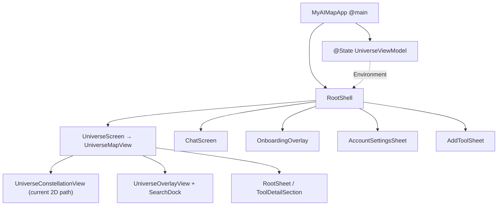
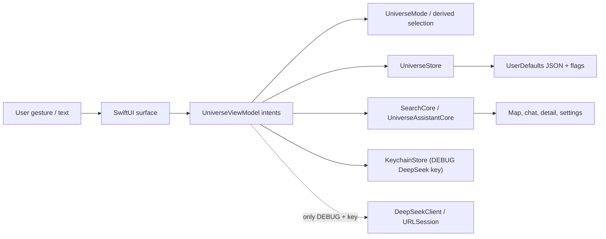
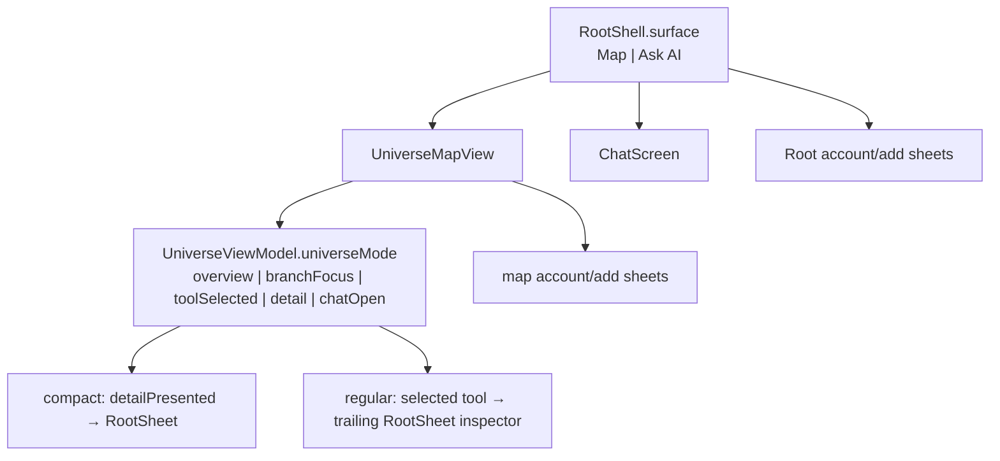
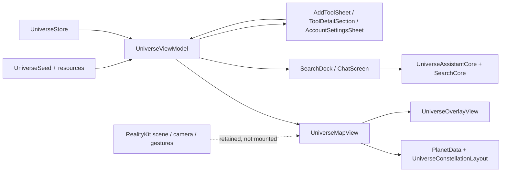

# ARCHITECTURE — Current iOS implementation

Status: reconstructed from current source. Paths are relative to `ios-app/`.
Where an historic document contradicts this file, inspect the cited source;
source is primary until runtime verification says otherwise.

## Bootstrap and composition

**CONFIRMED:** `Sources/MyAIMap/MyAIMapApp.swift` owns one `@State`
`UniverseViewModel`, injects it through SwiftUI Environment, applies dark
appearance, and recognizes UI-test launch arguments. `RootShell` is the first
visible view. It owns a separate root `RootSurface` (`.universe` / `.chat`),
onboarding overlay, and root-hosted Account/Add Tool sheets.

## State and data flow

- **CONFIRMED:** `UniverseViewModel.universeMode` is the stored map-level
  navigation owner; `selection` is a computed projection.
- **CONFIRMED:** `UniverseStore` serializes custom tools/categories, hidden
  IDs, haptics, onboarding flag, and placeholder subscription state.
- **CONFIRMED:** `UniverseAssistantCore` is local/default. `DeepSeekClient`
  is reached only through `AssistantBackend.debugDeepSeek`.
- **CONFIRMED:** assistant messages and activity history do not pass through
  `UniverseStore`; they are session-memory state.

## Navigation ownership

`RootSurface` and `UniverseMode` are intentionally different layers. The first
changes the full primary screen; the second describes map-level selection and
overlay state. `UniverseMapView` still has local presentation booleans for
detail/account/add; see `STATE_OWNERSHIP.md` for their boundary.

## Feature dependency map

## Module boundaries

| Area | Actual owner and examples | Dependency direction | Risk |
| --- | --- | --- | --- |
| Bootstrap | `MyAIMapApp.swift`, `RootShell.swift` | App → environment model → surfaces | High |
| Global domain/state | `State/UniverseViewModel.swift`, `UniverseStore.swift`, `UniverseSelection.swift` | Views call model intents; model persists | Critical |
| Current map | `UniverseMapView.swift`, `UniverseConstellationView.swift`, `UniverseConstellationLayout.swift` | Model data/mode → deterministic layout → SwiftUI nodes | Critical during transition |
| Map overlay/input | `UniverseOverlayView.swift`, `SearchDock.swift` | Reads model; requests mode/sheet transitions through closures | High |
| Tool flows | `AddToolSheet.swift`, `ToolDetailSection.swift`, `RootSheet.swift` | Read/mutate model; modal host remains parent | High |
| Assistant | `UniverseAssistantCore.swift`, `SearchCore.swift`, `DeepSeekClient.swift` | Model → local rules; debug network is optional | Medium/high |
| Legacy spatial path | `UniverseRealityView.swift`, `UniverseSceneController.swift`, entity/camera/gesture files | Not mounted by current map | High / experimental |
| Shared visuals | `UI/Theme/*`, `UI/Effects/LiquidGlass.swift`, `UI/Components/Glass/*` | All view layers consume tokens/modifiers | High |
| Tests | `Tests/MyAIMapTests`, `Tests/MyAIMapUITests` | Pure cores plus UI harness | Medium |

## Rendering technologies

### Current path

**CONFIRMED:** The body of `UniverseMapView.universeStack` constructs
`UniverseConstellationView`, a SwiftUI/Canvas deterministic 2D map. It receives
planets and `UniverseMode`, and emits only category/tool/empty-tap callbacks.
`UniverseOverlayView` is layered above it; `showsProjectedMapLabels: false`
disables camera-projected legacy labels.

### Retained spatial path

**CONFIRMED but currently unreachable from the main map:** `UniverseRealityView`
contains `RealityView` plus tap/drag/magnification gestures; it accepts
`UniverseSceneController`, `CameraRigController`, and
`UniverseGestureController`. `UniverseMapView` currently still allocates those
controllers and invokes camera focus methods, although the rendered 2D map does
not consume them. Treat any attempt to re-enable this path as an architecture
change requiring a separate task and runtime QA.

## External framework and configuration facts

- SwiftUI, Observation, UIKit, PhotosUI, UniformTypeIdentifiers, Security,
  RealityKit, and simd appear in source. No package manifest or third-party
  package dependency is present in `ios-app/`.
- `project.yml` is the XcodeGen source of truth; `MyAIMap.xcodeproj` is
  generated/ignored but exists in the current workspace.
- The project targets iOS 18; Liquid Glass APIs are availability-gated for iOS
  26 with material/matched-geometry fallbacks for older supported OS versions.

## Architecture risks and current contradictions

- **CONFIRMED:** some existing docs still call the RealityKit path primary or
  describe 2D/3D switching that current `UniverseMapView` does not expose.
- **CONFIRMED:** legacy controllers are retained and instantiated in the 2D
  host, creating a broad change boundary and dead-path maintenance cost.
- **CONFIRMED:** `UniverseOverlayView` defines right-rail support but its body
  does not mount it. Specs must not say the rail is live without a runtime
  check.
- **REQUIRES RUNTIME VERIFICATION:** the uncommitted 2D renderer's actual
  behavior on device/simulator and its interaction with map sheets/keyboard.
