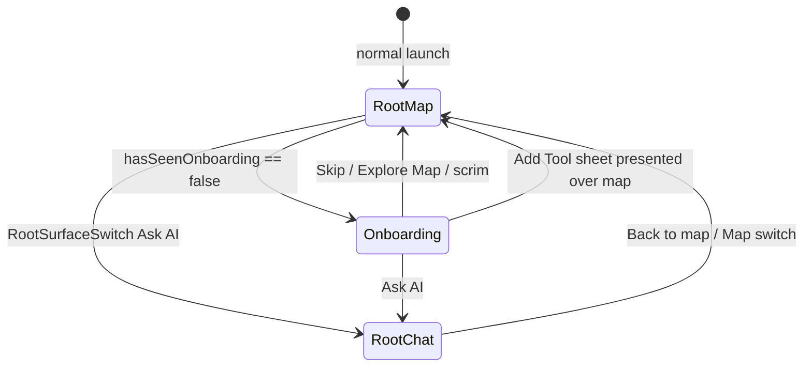
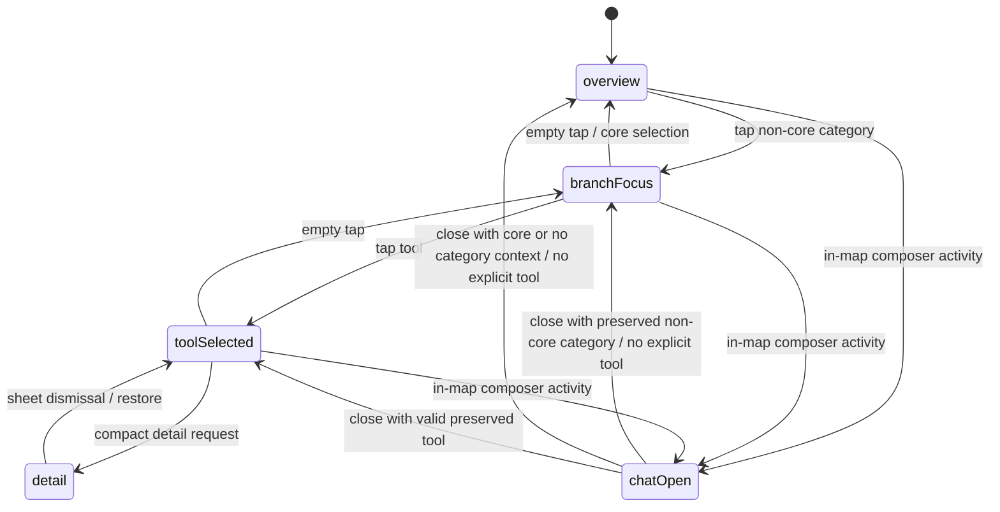

# NAVIGATION_SPEC — Actual routes, sheets, and dismissal behavior

Status: current-source reconstruction. This app does not use a top-level
`NavigationStack`/`NavigationPath` for primary routing. It composes SwiftUI
surfaces with `RootShell`, `UniverseMode`, and sheets.

**UI architecture links:** navigation/presentation changes must follow
`UI_APPLE_NATIVE_SPEC.md`, `UI_COMPONENT_LIFECYCLE.md`, and
`UI_COMPONENT_IDENTITY.md`, `UI_TRANSITION_CATALOG.md`, and
`UI_QA_CHECKLIST.md`. The current compact detail split-owner issue is recorded
in `SPEC_CONFLICTS.md`; do not add a third presentation owner.

## Navigation owners

- `RootShell.surface` owns only root-level Map/Ask AI.
- `UniverseViewModel.universeMode` owns map-level overview/branch/tool/detail/
  in-map-chat semantics.
- `RootShell` and `UniverseMapView` independently host their own Account/Add
  Tool sheets according to the active route.

## Transition table

| Source state | User action | Destination / state mutation | Animation / visual result | Dismissal or cancellation | Accessibility evidence |
| --- | --- | --- | --- | --- | --- |
| App cold start | launch | `RootShell.surface = .universe` | map-first, dark | N/A | **CONFIRMED** source behavior. |
| Onboarding | Ask AI | mark onboarding seen; root chat | overlay exits; route changes | Skip/scrim acts as Explore Map | labeled AX IDs for actions/scrim. |
| Onboarding | Add Tool | mark seen; root Add Tool sheet | sheet zoom transition where available | sheet dismiss returns map | `Onboarding.AddTool`. |
| Root map | Ask AI switch | `RootShell.surface = .chat`; root helper may prefill query | root dive/crossfade, source morph | Map switch/back calls `showUniverse(resetSelection: true)` | `RootShell.ShowChat`, `ChatScreen.BackToMap`. |
| Root chat | Back to map | root surface map and map mode reset to overview | dive/crossfade | no prior-selection restoration | **CONFIRMED source;** historical docs claiming exact restoration are stale. |
| Map overview | tap category node | model `.branchFocus(category)` | constellation layout morph; haptic | empty tap returns overview | buttons have `ConstellationCategory.*` IDs. |
| Map branch | tap tool node | model `.toolSelected(category, tool)` | selected-node emphasis | empty tap steps to branch/overview | `ConstellationStar.*`; normal Button semantics. |
| Map selected tool | re-tap selected tool | compact: `.detail` plus sheet; regular: inspector | sheet/inspector | compact sheet dismissal restores stored/derived mode | **REQUIRES runtime verification** for interactive dismissal. |
| Map branch/category | re-tap focused category | focus camera legacy hook or overview/detail behavior | no live camera effect under 2D renderer | varies by current mode | runtime behavior needs test. |
| Map overview/branch/tool | empty-space tap | keyboard resigns and `steppedBack` runs | map layout changes | unavailable while detail or in-map chat | background tap only when mode permits gestures. |
| In-map composer | focus/send/attachment state | callback may enter `.chatOpen(context)` | map remains atmospheric, dock panel may reveal | blur/collapse/empty map action restores context | source has focus/attachment AX IDs; keyboard behavior needs runtime QA. |
| Root or map | Account | route-local Account sheet | iOS zoom transition if available | system sheet dismissal | Account buttons have identifiers. |
| Root or map | Add Tool | route-local Add Tool sheet, optional draft | zoom transition if available | dismiss clears draft | validation/confirmation live inside sheet. |
| Detail | open related tool | focus related tool, reuse detail/inspector path | current sheet stays/rebinds on compact | close returns map mode | tool detail provides semantic actions. |
| Detail | hide/delete eligible tool | hidden ID persists; selected mode falls back | sheet/mode sync reacts | confirmation dialog before removal | **CONFIRMED:** core is guarded. |

## Map-level state machine

`detail` has different implementation on regular width: the inspector derives
from a selected tool while the mode often remains `.toolSelected`.

## Modal and system presentation

- `AddToolSheet` and `AccountSettingsSheet` contain `NavigationStack` for their
  own modal navigation/chrome; primary app routing is still not a stack.
- Detail uses `.sheet`, configured on compact widths with detents, interactive
  background, drag indicator, and 42-point presentation corner radius.
- `ToolDetailSection` can present an in-app Safari sheet (`SFSafariViewController`)
  or a DuckDuckGo search URL when a tool lacks a website.
- `SearchDock` may invoke PhotosPicker and file importer system presentation.
- No full-screen cover, deep link, URL handler, notification routing, universal
  link, `NavigationPath`, or state-restoration code was found.

## Gesture-driven navigation and cancellation

- Current 2D map: taps only in overview/branch/tool modes. There is no active
  pan/pinch/camera movement; `.chatOpen` disables canvas gestures, so its
  close/restore path belongs to the dock's activity, blur, or collapse
  callbacks rather than an empty-map tap.
- Right-edge rail long-press/drag gestures exist in source but the rail is not
  mounted, so they are not current runtime navigation.
- The retained RealityKit drag/pinch/tap path is unmounted and must be called
  **LEGACY/EXPERIMENTAL**, not an implemented transition.
- Sheet swipe-to-dismiss is system-provided; cancellation timing and resulting
  mode restoration require simulator verification.

## Restoration and deep links

**CONFIRMED absent:** navigation route, root surface, map selection, camera,
and chat transcript are not persisted/restored. Only user catalog/settings
data described in `DATA_AND_PERSISTENCE.md` survives through `UniverseStore`.
No deep-link behavior is implemented.

## Navigation acceptance criteria for future patches

1. Preserve the distinction between root route and map mode.
2. Do not leave a local sheet Boolean true after the mode/data it presents is
   invalid.
3. Verify compact and regular-width behavior separately.
4. Verify root chat return semantics intentionally; it currently resets map
   selection rather than restoring an exact prior route.
5. Do not claim rail, camera, or 3D gesture behavior unless the component is
   mounted and exercised at runtime.
