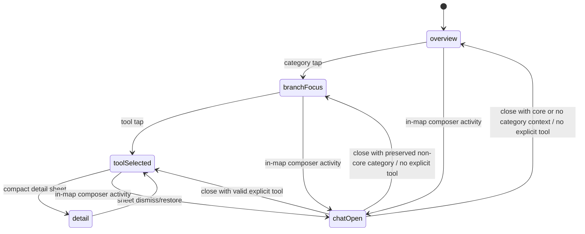
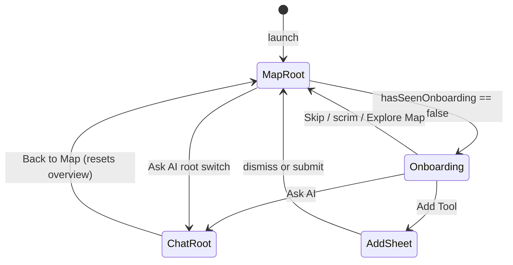
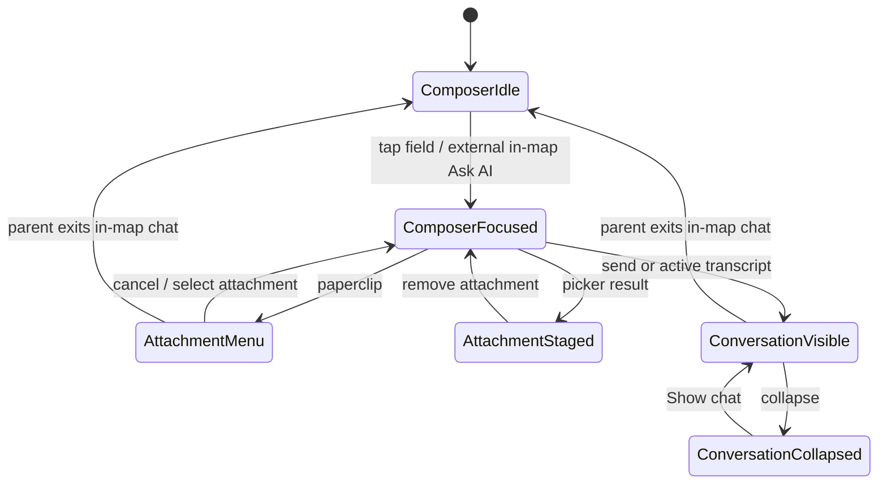
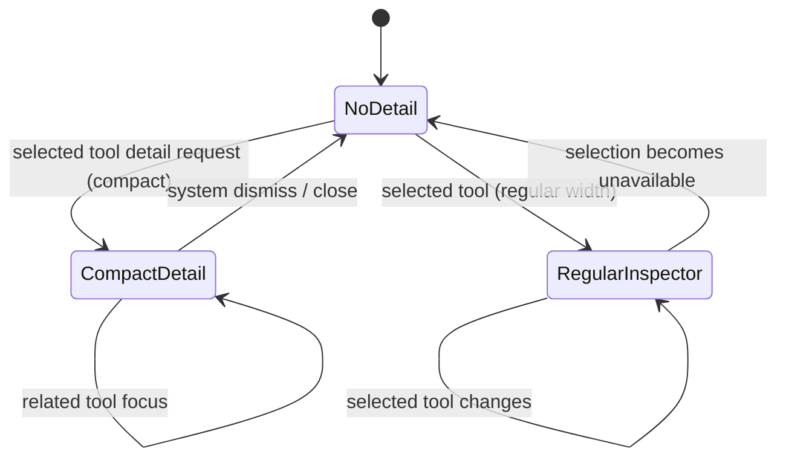

# UI_STATE_MACHINE — navigation & overlay state

> **Historical/target-state warning — 2026-07-16.** The goal, target model,
> transition list, and prior implementation notes before **Current baseline
> override** preserve earlier handoff context. The source-verified baseline at
> the end of this file is the current contract; it supersedes conflicting
> wording above.

**UI architecture links:** before changing state that affects UI, read
`UI_APPLE_NATIVE_SPEC.md`, `UI_COMPONENT_IDENTITY.md`, and
`UI_TRANSITION_CATALOG.md`. One owner is required for a transition route and
its progress; open conflicts are tracked in `SPEC_CONFLICTS.md`.

## Goal
One source of truth for navigation. Eliminate desync between the 3D map,
bottom chips, right rail, and the detail card. Make impossible visual states
unrepresentable.

## Global vs local state (important)
Not everything belongs in the global machine. Over-centralizing input focus
is itself a bug source.

**Global (single source of truth — the navigation machine):**
- `selectedCategory` (`ToolCategoryId`)
- `selectedTool` (`String` tool id)
- `universeMode` — overview / branchFocus / toolSelected / detail / chatOpen
- `isChatOpen` — derived from `universeMode == .chatOpen`
- `isRailActive` — rail drag in progress (transient navigation input)

**Local (per-view, must NOT flip global visuals):**
- `isInputFocused` (`@FocusState` in `SearchDock`) — keyboard/layout only.
- `attachmentState` (none / menu-open / attached) — local to `SearchDock`.

Rule: a local state may *request* a navigation transition (e.g. focusing the
input opens chat) but may never directly drive global dimming/blur. The
"input focus blacks out the universe" bug is exactly a local state wrongly
driving a global visual. Fix by decoupling, not by hoisting input into the
global machine.

## Current reality (as audited, pre-refactor)
- `universeMode` lives as `@State` in `UniverseMapView` (`UniverseMode` enum).
- `selectedCategory`/`selectedTool` live in `viewModel.selection`
  (`UniverseSelection`).
- They are kept in sync **manually**: `UniverseMapView.selectCategory` /
  `focusToolFromMap` mutate `mode`, and separately call
  `model.selectCategory` / `model.focusTool` which mutate `selection`.
- Sheet presentation uses extra booleans: `detailPresented`,
  `accountPresented`, `addToolPresented`.
- Most derived visibility already funnels through `UniverseMode` (good):
  `showsSatellites`, `showsToolAnchor`, `showsToolLabels`, `showsPlanetLabels`,
  `mapOpacity`, `mapBlurRadius`, `dimOpacity`, `orbitOpacityMultiplier`.

→ The enum is already a near-complete machine. The fix is to make
`selectedCategory`/`selectedTool` **derive from `universeMode`** (or make the
model own `universeMode` too), so there is exactly one writer.

## Target model

`UniverseMode` is the single navigation state. `selectedCategory` and
`selectedTool` are computed from it (`focusedCategory`, `selectedToolID`
already exist on the enum). Whoever owns `universeMode` owns navigation.
Recommended owner: `UniverseViewModel` (so model + view share one value and
the view stops holding a parallel copy). Detail/account/add-tool sheets derive
their booleans from `universeMode` instead of independent flags.

### State variables (single writer each)
| Variable | Type | Owner | Notes |
|---|---|---|---|
| `universeMode` | `UniverseMode` | model | the machine |
| `selectedCategory` | `ToolCategoryId` | derived | `universeMode.focusedCategory` |
| `selectedTool` | `String?` | derived | `universeMode.selectedToolID` |
| `isChatOpen` | `Bool` | derived | `if case .chatOpen` |
| `isDetailOpen` | `Bool` | derived | `if case .detail` |
| `isRailActive` | `Bool` | rail gesture | transient; not a mode |
| `isInputFocused` | `Bool` | `SearchDock` local | layout only |
| `attachmentState` | enum | `SearchDock` local | none/menu/attached |

## Allowed transitions
```
overview        → branchFocus(cat)         (tap/scroll into a category)
branchFocus     → toolSelected(cat, tool)  (tap a satellite)
toolSelected    → detail(cat, tool)        (tap again / open card)
any non-detail  → chatOpen(prevCtx)        (focus input / open chat)
chatOpen        → previous map mode         (dismiss chat)
any map mode    → railActive               (begin rail drag)  [transient]
railActive      → branchFocus(cat)          (release on a category)
detail          → previous map mode         (dismiss sheet)
```
`isInputFocused` is a secondary input state layered on the current map mode;
it must not replace `universeMode`.

## Forbidden (impossible) states — must be unrepresentable
- `detail` and `chat` both primary at once → they are distinct enum cases, so
  only one can be active. Sheets must derive from the case, not independent
  booleans that can both be true.
- Input focused causing a full-black/empty universe → input focus may dim
  *slightly* (atmospheric) but the map stays visible. Global dim/blur is a
  function of `universeMode` ONLY (`mapOpacity`, `mapBlurRadius`, `dimOpacity`).
- Rail active while keyboard layout is broken → entering `railActive` must
  resign first responder / not coexist with an open keyboard.
- Duplicated Add-tool / Attach-files controls → these actions live in exactly
  one place per state (see `INPUT_CHAT_SPEC.md`).
- Detail card showing a tool that is not the map-selected tool → the card
  reads `selectedTool` from the same machine the map renders from.

## Layering (primary overlay) rules
Exactly one *primary* overlay at a time, in this z-priority:
`detail` sheet > `chat` panel > tool anchor/labels > rail > map.
`detail` and `chat` are mutually exclusive primary overlays.

## Acceptance criteria (for the State Machine task)
- selected branch/tool consistent across map, bottom card, bottom chips, rail.
- focusing input does not black out the app.
- chat/detail mutually exclusive as primary overlays.
- no duplicate Add-tool / Attach-files due to state conflict.
- code compiles; tests green (xcresult `passedTests`).

## Implementation notes (Agent 1 — landed)

**Owner.** `UniverseViewModel.universeMode: UniverseMode` is now the single
stored navigation state. It replaced the view-local `@State mode` that used to
live in `UniverseMapView`.

**Projection.** `UniverseViewModel.selection` is now a *computed* read-only
projection of `universeMode`:
- `activeCategory = universeMode.focusedCategory`
- `selectedToolID = universeMode.selectedToolID ?? firstTool(of: focusedCategory)`
  — the "always-a-tool" default (overview/branchFocus still yield a card-able
  tool, preserving Phase 1 behaviour and the existing tests).
- `hoveredToolID` moved to its own stored property (hover is orthogonal to the
  navigation mode).
All existing `model.selection.activeCategory / .selectedToolID` readers
(`CategoryRail`, `ToolDetailSection`, `AddToolSheet`) were left untouched — they
keep working through the projection.

**One writer per concern.** Model intents (`selectCategory`, `selectTool`,
`focusTool`, `focusFirstSearchMatch`, `deleteTool`) now write `universeMode`
only. The view writes `model.universeMode` directly for the view-owned modes
(`detail`, `chatOpen`, restore). `mode` in `UniverseMapView` is a read alias:
`private var mode: UniverseMode { model.universeMode }`.

**Two-way sync deleted.** The old desync engine — `reconcileMode(with:)` plus
`.onChange(of: model.selection)` that pushed selection→mode while actions
pushed mode→selection — is gone. With one storage and a derived projection,
map / chips / rail / card cannot disagree.

**Input-focus / black-screen.** Global dim/blur is a function of `universeMode`
only (`Color.black.opacity(mode.dimOpacity)` in `UniverseMapView`; the map's
`.opacity(mode.mapOpacity).blur(mode.mapBlurRadius)` in `UniverseRealityView`).
`chatOpen` values were softened so focusing the input dims slightly but keeps
the universe atmospheric instead of black:
- `mapOpacity` 0.22 → 0.55, `dimOpacity` 0.58 → 0.32, `mapBlurRadius` 1.4 → 1.0.
`isInputFocused` and `attachmentState` remain local to `SearchDock` and do not
drive these values.

## Known limitations / handoff
- `chatOpen` is still entered on bare input focus (via `SearchDock`'s
  `onChatActivityChange`). The softened values stop the black-out, but whether
  focus should enter a lighter "composer" state vs full `chatOpen` is an
  INPUT_CHAT (Agent 2) call — left untouched to respect domain boundaries.
- `isRailActive` is not yet modelled as explicit state; the rail still owns its
  own gesture flag (RIGHT_RAIL — Agent 3).
- `modeBeforeDetail` and the three sheet booleans (`detailPresented`,
  `accountPresented`, `addToolPresented`) remain view-local. They are driven by
  `universeMode` for detail; account/add-tool are pure presentation and were
  left as-is.

### Codex follow-up - TestFlight stabilization state fixes (2026-06-21)

**Chat context.** `UniverseMode.chatContext(...)` now preserves only an
explicitly selected tool. Branch focus still opens branch chat, but the
projection fallback tool is not smuggled into chat context. This keeps the chat
panel, selected card, graph, chips, and detail route from disagreeing.

**Mode ownership.** `UniverseMapView` no longer rewrites `model.universeMode`
from `navigationModeForSelection()` on appear. The model remains the single
navigation owner, which avoids startup/return-to-view selection jumps.

**Core selection.** Core satellite selections are treated as real focused tools
for bottom-card state, so OpenSwarm/Founder OS style selections do not get
silently collapsed back to category focus.

## Changed files / QA done / Remaining issues
**Changed files**
- `State/UniverseViewModel.swift` — `universeMode` storage, computed
  `selection`, `hoveredToolID`, rewritten intents.
- `Universe/UniverseMapView.swift` — removed `@State mode`; read alias; all
  writes routed to `model.universeMode`; deleted `reconcileMode` +
  `onChange(model.selection)`.
- `Universe/UniverseMode.swift` — softened `chatOpen` map/dim/blur values.
- `Tests/MyAIMapTests/UniverseModeTests.swift` — updated the chat-suppression
  assertion to the new atmospheric-not-black contract.

**QA done**
- Build green, Swift Testing suite green on iPhone 17 sim (see commit).
- All 14 `UniverseViewModelTests` selection/category/tool contracts preserved
  via the projection + first-tool default.

**Remaining issues**
- Visual/runtime QA (simulator) per `QA_REGRESSION_CHECKLIST.md` not yet run:
  confirm no desync across map/chips/rail/card on device, and that chat focus
  is atmospheric not black.
- Agent 2/3/4/5 domains untouched by design.

---

## Current baseline override — 2026-07-16

This addendum supersedes historical claims in this document when they disagree
with the current source snapshot.

- **CONFIRMED:** `UniverseViewModel.universeMode` is the only stored map-mode
  value. `UniverseViewModel.selection` is computed from it; there is no current
  stored `hoveredToolID` in the model.
- **CONFIRMED:** this is a map-level machine only. Root-level Map/Ask AI route
  ownership remains `RootShell.surface`, and root chat return intentionally
  resets to overview rather than restoring an exact map route.
- **CONFIRMED:** `UniverseMapView` still has local `detailPresented` and
  `modeBeforeDetail`; these synchronize with `.detail` on compact layouts.
  This is a presentation mirror, not a second selection owner, but it is a
  high-risk synchronization boundary.
- **CONFIRMED:** a regular-width inspector may present selected tool content
  while the model remains `.toolSelected`; it is not the `.detail` case.
- **CONFIRMED:** rail gesture state is not merely local — the rail itself is
  currently unmounted. Do not treat a rail-active transition as user-reachable.
- **CONFIRMED:** the current mounted map is `UniverseConstellationView`; the
  RealityKit camera/gesture state machine is retained but dormant.



See `STATE_OWNERSHIP.md` for the authoritative ownership matrix and
`NAVIGATION_SPEC.md` for root/sheet routes.

### Root surface and onboarding machine



- **Entry:** `RootShell` starts on Map regardless of onboarding status.
- **Visible UI:** onboarding overlays root surfaces; root Map/Ask AI switch
  remains the primary route control.
- **Cancellation/recovery:** Skip/scrim persist onboarding completion and
  recover Map. Add sheet dismissal retains map route. Root Chat return does
  **not** promise selection restoration.
- **Persistence effect:** only `hasSeenOnboarding` persists; root surface does
  not.
- **Invalid transition:** do not encode root Chat as `.chatOpen`; it is a
  separate root state.

### In-map assistant dock machine



- **Entry conditions:** focus, visible messages, attachment staging, or menu
  activity determines whether it requests `UniverseMode.chatOpen`.
- **Visible UI:** only one floating lane may display attachment menu or preview;
  conversation panel and collapsed pill are mutually exclusive.
- **Cancellation/recovery:** picker cancellation restores field focus; parent
  mode exit clears focus/menu and collapses transcript but preserves the model
  transcript while the model lives.
- **Persistence effect:** none for focus, payload, collapse, query, or message
  transcript.
- **Invalid transition:** attachment menu and preview must not display together;
  local focus must not create a second map-navigation source.

### Modal detail machine



- **Entry conditions:** compact uses a sheet plus `.detail`; regular derives a
  trailing inspector from an explicit selected tool.
- **Cancellation/recovery:** compact swipe/dismiss maps through local
  `modeBeforeDetail`/derived selection; this requires runtime verification.
- **Persistence effect:** none for presentation or selection.
- **Invalid transition:** never show detail for a hidden/missing tool; do not
  assume regular inspector uses `.detail`.
